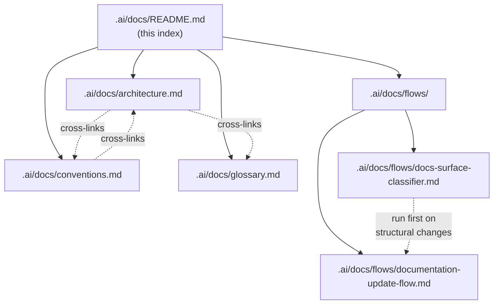

# Baseline docs (harness blueprint)

Human-readable documentation for the **baseline harness** that ships with every project from this template. It lives under **`.ai/docs/`** so it travels with `.ai/` (protocols, todo) as one unit.

## TL;DR

- **This folder (`.ai/docs/`)** = blueprint, architecture, conventions, flows, and glossary for the harness and repo layout. Update it on every **structural** change to the baseline (folders under `.ai/` for harness, `.cursor/`, `.claude/`, charters, root config, etc.) — **after** you run [`.ai/docs/flows/docs-surface-classifier.md`](flows/docs-surface-classifier.md) and your label is **not Product-only**.
- **Root `docs/`** = the **product / application** documentation package (what you ship: `scripts/`, `src/`, …). Populate it when you have product code. Same maintenance rules apply — see [`.ai/protocols/DOCS_MAINTENANCE_PROTOCOL.md`](../protocols/DOCS_MAINTENANCE_PROTOCOL.md).
- Every structural change must update the relevant doc surface in the **same change** (baseline here + root `README.md` for harness; product under `docs/` when your classifier label includes **Product**).
- Diagrams are **Mermaid**, embedded inline.
- Linked from the root [`README.md`](../../README.md) — start there if you arrived without context.

## Diagram — what lives where in this package

## Files

| File | Answers | When to update |
|------|---------|----------------|
| [`architecture.md`](architecture.md) | How is the baseline repo structured and how do the parts interconnect? | Any structural change to harness paths, protocols, rules, or baseline layout. |
| [`conventions.md`](conventions.md) | Where do I put a new harness artifact, and what do I name it? | Naming or directory rules for `.ai/`, `.cursor/`, `.claude/` change. |
| [`flows/project-startup.md`](flows/project-startup.md) | **One-stop** greenfield checklist: todos, GitHub, push auth, `/git-push-verify`, docs classifier, skills/rules map. | New clone, first GitHub push, or “full startup” request. |
| [`flows/docs-surface-classifier.md`](flows/docs-surface-classifier.md) | Which doc tree do I edit — baseline `.ai/docs/` or product `docs/`? | **Every** structural change **before** other doc edits. |
| [`flows/documentation-update-flow.md`](flows/documentation-update-flow.md) | What exact steps do I run after classification? | Any structural change that updates documentation. |
| [`flows/`](flows/) | Other baseline workflow flow docs. | A new baseline workflow needs a dedicated flow doc. |
| [`glossary.md`](glossary.md) | What does *baseline docs* / *product docs* / *protocol* mean here? | Terms shift or new ones appear. |

## Product docs (`docs/` at repo root)

When application or library code exists, maintain a **separate** tree at repo root:

| Path | Purpose |
|------|---------|
| `docs/README.md` | Index of product documentation (add when you create the tree). |
| `docs/**` | User guides, API reference, runbooks, ADRs for the product — not the harness. |

Baseline docs **do not** move into root `docs/`; they stay here under `.ai/docs/`.

## Files this package may gain (baseline)

| File | Add when |
|------|----------|
| `.ai/docs/quickstart.md` | Baseline toolchain exists for the template itself. |
| `.ai/docs/diagrams/*.mmd` | Mermaid sources are reused across multiple baseline docs. |
| `.ai/docs/assets/` | A human explicitly asks for binary images for baseline docs. |

## How to read this package

1. Read the root [`README.md`](../../README.md) for the 60-second overview. If you are **greenfielding** this template (GitHub, first push, full harness path), read [`flows/project-startup.md`](flows/project-startup.md) next — then continue below.
2. Read [`architecture.md`](architecture.md) for the full baseline picture.
3. Skim [`conventions.md`](conventions.md) before adding harness files.
4. Open [`flows/docs-surface-classifier.md`](flows/docs-surface-classifier.md) **first** whenever a structural change might touch docs — then [`flows/documentation-update-flow.md`](flows/documentation-update-flow.md).
5. Use [`glossary.md`](glossary.md) when a term feels overloaded.

## How to maintain (agents + humans)

Follow [`.ai/protocols/DOCS_MAINTENANCE_PROTOCOL.md`](../protocols/DOCS_MAINTENANCE_PROTOCOL.md). Do not duplicate protocol text here.

## Examples

- **Added `.github/workflows/ci.yml` for the template:** update root `README.md`, `.ai/docs/architecture.md`, `.ai/docs/conventions.md`, and `AGENTS.md` in one change.
- **Started the product and added `src/`:** run [docs-surface-classifier.md](flows/docs-surface-classifier.md) → **Product-only** column; update **root `docs/`** (index, architecture, API docs). **Do not** add `src/` layout rows to `.ai/docs/conventions.md`.
- **Renamed `.ai/todo/`:** update protocols, `.vscode/settings.json`, root `README.md`, and all affected files under `.ai/docs/`.

## Changelog

- 2026-05-12 — Files table + “How to read”: [`flows/project-startup.md`](flows/project-startup.md) one-stop greenfield path {cursor}
- 2026-05-12 — fixed example: new `src/` updates root `docs/` only (not baseline `.ai/docs/conventions.md`) {cursor}
- 2026-05-12 — linked mandatory [docs-surface-classifier.md](flows/docs-surface-classifier.md) in index + diagram; clarified when `.ai/docs/` updates {cursor}
- 2026-05-12 — moved baseline package from repo `docs/` to `.ai/docs/`; clarified split vs root `docs/` for product {cursor}
- 2026-05-12 — initial docs package scaffold (was at `docs/`) {cursor}

## Last touched
{cursor} 2026-05-12
