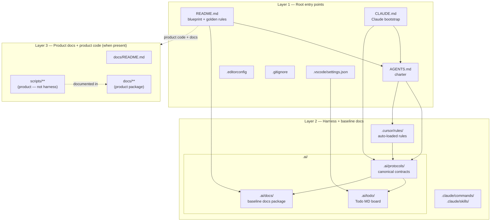

# Architecture

How the repository is laid out and how every piece is wired together.

## TL;DR

- **Layers:** *root files* (entry points, charters), *harness* (`.ai/` including protocols + todo + **`.ai/docs/`** baseline docs, `.cursor/`, `.claude/`), and *product* (code such as **`scripts/`** / **`src/`** plus the **`docs/`** package at repo root).
- The **harness** is the contract between humans and agents. **`.ai/docs/`** describes that baseline only. **Root `docs/`** is the **product** documentation package — use it as soon as you ship product code; do not put product CLI reference into `.ai/docs/*`.
- Two **canonical protocols** under `.ai/protocols/` are the only sources of truth for working agreements: Todo MD and Docs Maintenance.
- Cursor rules under `.cursor/rules/` are **pointers** — they reference the protocols and never restate the rules.
- `CLAUDE.md` is a thin Claude Code bootstrap that **defers to `AGENTS.md`** for the full charter.
- The task board under `.ai/todo/` is read by the Todo MD VS Code extension; paths are wired in `.vscode/settings.json`.

## Layered view



## Layer 1 — Root entry points

| File | Role |
|------|------|
| `README.md` | First thing a human reads. TL;DR, blueprint, golden rules, links. |
| `AGENTS.md` | Human + agent charter. Working agreements live here. |
| `CLAUDE.md` | Claude Code session-start bootstrap. **Thin** — defers to `AGENTS.md`. |
| `.editorconfig` | Whitespace + charset baseline for every editor. |
| `.gitignore` | Standard ignore set: secrets, build, deps, OS, IDE. |
| `.vscode/settings.json` | Workspace settings. Currently wires Todo MD paths under `.ai/todo/`. |

**Why two entry-point docs (`README.md` and `AGENTS.md`)?** Different audiences. `README.md` greets *any* reader; `AGENTS.md` is the working-agreements charter and is the first place an autonomous agent should consult.

## Layer 2 — Harness and baseline docs

The harness is the **how**: how agents and humans work, where contracts live, how rules get loaded. **`.ai/docs/`** is the **what** for the baseline template itself (structure, naming, flows).

### `.ai/protocols/` — canonical contracts

Single source of truth for every working agreement. Each protocol is **self-contained**; everything else points here.

| Protocol | Governs |
|----------|---------|
| `TODO_MD_AGENT_PROTOCOL.md` | The Todo MD task board (`.ai/todo/*.md`) — line shape, actor markers, never-delete rule, completion notes. |
| `DOCS_MAINTENANCE_PROTOCOL.md` | Baseline docs (`.ai/docs/`, root `README.md`) and product docs (`docs/` when present) — triggers, targets, required shape, actor markers. |

New protocols go here. Each new protocol gets a matching pointer rule under `.cursor/rules/`.

### `.ai/docs/` — baseline documentation package

| File | Role |
|------|------|
| `.ai/docs/README.md` | Index of the baseline package. |
| `.ai/docs/architecture.md` | This file. |
| `.ai/docs/conventions.md` | Where to put harness artifacts, what to name them. |
| `.ai/docs/flows/*.md` | One file per named baseline workflow. |
| `.ai/docs/glossary.md` | Definitions for baseline-specific terms. |

### `.cursor/rules/` — auto-loaded Cursor rules

Every `.mdc` file with `alwaysApply: true` is loaded by Cursor on every turn.

| Rule | Role |
|------|------|
| `foundations.mdc` | Baseline engineering habits (small changes, no secrets, validate input). Also points at both protocols. |
| `todomd-collaboration.mdc` | Pointer rule — defers to `TODO_MD_AGENT_PROTOCOL.md`. |
| `docs-maintenance.mdc` | Pointer rule — defers to `DOCS_MAINTENANCE_PROTOCOL.md`. |
| `project-startup.mdc` | **One-stop onboarding** — points to [`.ai/docs/flows/project-startup.md`](../../.ai/docs/flows/project-startup.md) + Cursor project skill; complements `project-init.mdc`. |
| `project-init.mdc` | Session-start checks for Cursor: auto-creates missing `.ai/todo/*.md` files, prompts GitHub setup if `.ai/config/project.json` absent, gates agent-assisted HTTPS `git push` behind a PAT prompt unless `push_transport` is `ssh`. |

**Pattern:** rules **never duplicate** protocol content. They state "read this file" and the golden rule in one paragraph. The protocol is always the maintained copy.

### `.claude/` — Claude Code surface only

| Path | Role |
|------|------|
| `.claude/commands/project-startup.md` | `/project-startup` — routes to [`flows/project-startup.md`](flows/project-startup.md) (one-stop checklist). |
| `.claude/commands/github-setup.md` | `/github-setup` — connect repo; writes `.ai/config/project.json`; HTTPS or SSH `origin`. |
| `.claude/commands/git-push-verify.md` | `/git-push-verify` — stage, commit, push, fetch, verify on GitHub. |
| `.claude/skills/project-startup/SKILL.md` | Claude **project-startup** skill — same triggers as Cursor twin under `.cursor/skills/`. |
| `.claude/skills/` | Other skills (add as needed). |
| `.claude/settings.local.json` | Claude Code permissions + hooks wiring. References the hook scripts. |
| `.claude/hooks/pre-tool-check.sh` | PreToolUse hook: **blocks all tool calls** (except `Read`) until `AGENTS.md` has been read. |
| `.claude/hooks/post-tool-read.sh` | PostToolUse hook (Read matcher): removes sentinel once `AGENTS.md` is confirmed read. |
| `.claude/hooks/session-init.sh` | SessionStart hook: auto-creates missing `.ai/todo/*.md` files; warns if `.ai/config/project.json` is absent. |
| `.claude/hooks/pre-push-check.sh` | PreToolUse hook (Bash matcher): blocks `git push` when using HTTPS+PAT flow; **allows** `git push` when `github.push_transport` is `"ssh"` (SSH `origin`). |

Claude Code reads these in addition to `CLAUDE.md`. Cursor ignores them.

**Active hooks:**

| Event | Matcher | Script | Mechanism |
|-------|---------|--------|-----------|
| `SessionStart` | — | inline | Creates sentinel `/tmp/.claude_must_read_agents`; prints blocked-until-read message. |
| `SessionStart` | — | `session-init.sh` | Creates missing todo files; prints GitHub setup reminder if `.ai/config/project.json` is absent. |
| `PreToolUse` | `.*` (all tools) | `pre-tool-check.sh` | **Hard block** — outputs `{"decision":"block"}` JSON for any tool except `Read` while sentinel exists. |
| `PreToolUse` | `Bash` | `pre-push-check.sh` | **HTTPS:** blocks `git push` until a PAT is used. **SSH:** no block when `push_transport` is `"ssh"`. |
| `PostToolUse` | `Read` | `post-tool-read.sh` | Removes sentinel when `AGENTS.md` is confirmed read. All tools unblocked. |
| `PostToolUse` | `Edit\|Write` | inline | Prints docs + todo checklist after every file edit. |

**GitHub config (`.ai/config/project.json`):**

Non-sensitive connection details written by `/github-setup`. Never contains passwords or tokens.

```json
{
  "github": {
    "repo_url": "https://github.com/<username>/<repo>",
    "username": "<username>",
    "push_transport": "https"
  }
}
```

`push_transport`: optional; `"https"` (default) or `"ssh"`. When `"ssh"`, use an SSH `origin` (`git@github.com:owner/repo.git`) and the pre-push hook does not require a PAT.

### `.ai/todo/` — task board

| File | Role |
|------|------|
| `todo.md` | Active tasks. |
| `someday.md` | Parked / backlog. |
| `todo.archive.md` | Archived completed tasks. |

Editor integration: `.vscode/settings.json` sets `todomd.activatePattern` and defaults. Rules of engagement live entirely in `.ai/protocols/TODO_MD_AGENT_PROTOCOL.md`.

## Layer 3 — Product docs and product code (optional)

**Not part of the harness.** Once you add application code (including standalone CLIs under `scripts/`), maintain a **product documentation package** at repo root **`docs/`**. Describe scripts, APIs, and domain there — **not** in `.ai/docs/`.

| Path | Role |
|------|------|
| `docs/README.md` | Index of the product documentation package. |
| `docs/**` | Product architecture, script reference, guides — see [`.ai/protocols/DOCS_MAINTENANCE_PROTOCOL.md`](../protocols/DOCS_MAINTENANCE_PROTOCOL.md) *Product-only vs harness-only*. |
| `scripts/**`, `src/**`, … | Product source. Document under `docs/`; do not treat as baseline harness structure for `.ai/docs/conventions.md`. |

## Interconnections — who reads what

| Reader | Reads (always) | Reads (when relevant) |
|--------|----------------|-----------------------|
| Cursor | `AGENTS.md`, `.cursor/rules/*.mdc` (`alwaysApply: true`) | `.ai/protocols/*.md` linked from rules |
| Claude Code | `CLAUDE.md` → defers to `AGENTS.md` | `.ai/protocols/*.md`, `.claude/commands/`, `.claude/skills/` |
| Human (new contributor) | `README.md` | `.ai/docs/architecture.md`, `.ai/docs/conventions.md`, `.ai/docs/flows/*`, and `docs/**` when the product tree exists |
| Todo MD extension | `.ai/todo/*.md` per `.vscode/settings.json` | — |
| GitHub UI | `README.md` (renders on landing) | — |

## What changes when something changes

| Change | Update |
|--------|--------|
| **Product-only:** new `scripts/`, `src/`, app folder, first product `.py` | Root **`docs/*`** (product package). **Do not** add product script names or CLI details to this file or to `.ai/docs/conventions.md`. Optional: root `README.md` map row pointing to `docs/README.md`. |
| **Harness-only:** new `.ai/` path, `.cursor/` rule, `.claude/` command, protocol | `README.md` (if map/golden rules change), **this file**, `.ai/docs/conventions.md` as appropriate. |
| New protocol under `.ai/protocols/` | `README.md` (golden rules table), this file, new `.cursor/rules/*.mdc` pointer. |
| New Cursor rule | This file, `.ai/docs/conventions.md` if it changes a harness convention. |
| New Claude command or skill | This file (`.claude/` table). |
| Toolchain command added (template-wide) | `AGENTS.md` "Commands and verification", `README.md` "Quick start" if shared. |
| Surface removed | Same docs as adding it — describe the removal and rationale. |

See [`.ai/protocols/DOCS_MAINTENANCE_PROTOCOL.md`](../protocols/DOCS_MAINTENANCE_PROTOCOL.md) for the full triggers table; it is the maintained copy.

## Examples

### Example 1 — Adding the first product folder `scripts/` (standalone CLI)

1. Add or update root **`docs/README.md`**, **`docs/architecture.md`** (product), and a script reference page under **`docs/scripts/`**.
2. Optionally add one **`README.md`** repository-map row pointing to **`docs/README.md`**.
3. **Do not** add script names or CLI tables to `.ai/docs/architecture.md` or `.ai/docs/conventions.md`.
4. Append changelog + Last touched on every touched file.

### Example 2 — Adding a third protocol (e.g. security review)

1. Create `.ai/protocols/SECURITY_REVIEW_PROTOCOL.md` (the canonical contract).
2. Create `.cursor/rules/security-review.mdc` pointing at it (no duplication).
3. Update `.ai/docs/architecture.md` Protocols table + Rules table.
4. Update `README.md` golden rules table.
5. Append changelog lines to every touched file.

### Example 3 — Renaming `.ai/todo/` to `.ai/board/`

1. Move files.
2. Update `.vscode/settings.json` (`todomd.*` paths).
3. Update `.ai/protocols/TODO_MD_AGENT_PROTOCOL.md` path references.
4. Update `README.md` map.
5. Update this file's diagram and tables.
6. Update `.ai/docs/conventions.md` if path references changed.
7. Append changelog lines.

## Changelog

- 2026-05-12 — added `project-init.mdc` Cursor rule: mirrors session-init and PAT-gate behaviour for Cursor (todo bootstrap, GitHub config check, push gate) {claude}
- 2026-05-12 — added `session-init.sh` (todo bootstrap + GitHub config check), `pre-push-check.sh` (PAT gate), `/github-setup` command, and `.ai/config/project.json` schema to `.claude/` tables {claude}
- 2026-05-12 — **One-stop startup:** [`flows/project-startup.md`](flows/project-startup.md); Cursor `project-startup.mdc` + `.cursor/skills/project-startup/`; Claude `/project-startup` + `project-startup` skill; expanded `.claude/commands` table {cursor}
- 2026-05-12 — removed `Co-authored-by` from `/git-push-verify` + rule mirror; root commit message rewritten without trailer {cursor}
- 2026-05-12 — `/git-push-verify` canonical commit message: append `Co-authored-by: Cursor <cursoragent@cursor.com>` when shipping from Cursor; Step 4 intro clarifies optional removal for non-Cursor commits {cursor}
- 2026-05-12 — GitHub push: optional `github.push_transport` (`https`|`ssh`); `pre-push-check.sh` allows `git push` when SSH; `/github-setup` and `/git-push-verify` document SSH host-key verification + PAT HTTPS path {cursor}
- 2026-05-12 — added PostToolUse hook to `.claude/` table; forces docs + todo check after every edit inline {claude}
- 2026-05-12 — added `.claude/settings.local.json` + SessionStart hook to `.claude/` table; documented mandatory-reads enforcement pattern {claude}
- 2026-05-12 — clarified Layer 3 as **product** code + `docs/` package; removed harness-specific `scripts/` / `weather_init` detail; added product-only doc example {cursor}
- 2026-05-12 — relocated baseline docs to `.ai/docs/`; documented optional root `docs/` for product {cursor}
- 2026-05-12 — initial architecture doc (was under `docs/`) {cursor}

## Last touched
{cursor} 2026-05-12
