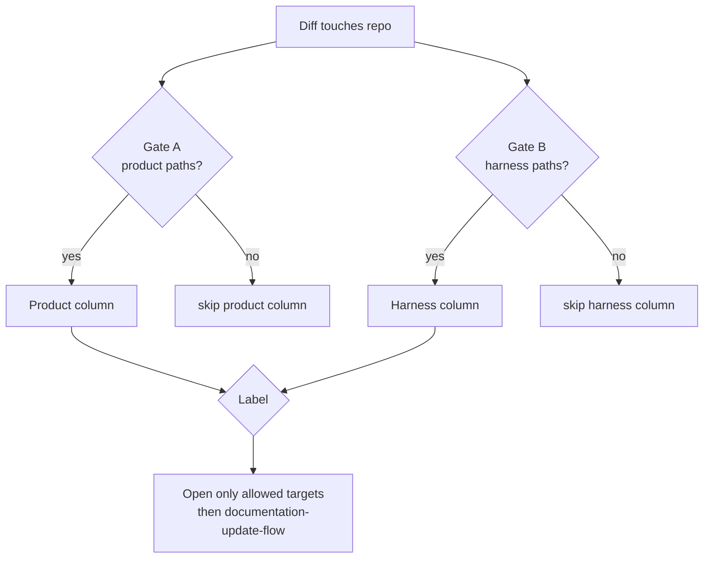

# Doc surface classifier (mandatory before doc edits)

**Run this checklist before you open any markdown file** for a structural change (new folder, new file class, new feature, new command, new dependency, removed surface). It prevents the recurring mistake: editing **`.ai/docs/*`** (harness baseline) when the change was **product-only** (`scripts/`, `src/`, …), or the reverse.

Canonical rules still live in [`.ai/protocols/DOCS_MAINTENANCE_PROTOCOL.md`](../../protocols/DOCS_MAINTENANCE_PROTOCOL.md) — this file is the **operational gate** agents run every time.

## TL;DR

1. List the **paths your change touches** (files + folders).
2. Answer the **three gates** below. You must end with exactly one label: **Product-only**, **Harness-only**, or **Both**.
3. Open **only** the doc targets that label allows — then follow [documentation-update-flow.md](documentation-update-flow.md).
4. If you are about to put a **script name, CLI flag table, or app module layout** into **`.ai/docs/architecture.md`** or **`.ai/docs/conventions.md`**, **STOP** — that belongs under root **`docs/`**.

## The three gates

Answer **yes / no** for each.

### Gate A — Product paths

Did the change add or modify anything under **any** of these (or similar application roots)?

- `scripts/`
- `src/`
- `app/`
- `lib/`
- `packages/`
- `services/`
- `frontend/`, `backend/`, `web/`, `mobile/`
- Product-only config at repo root (`docker-compose.yml` for the app, app `Dockerfile`, `pyproject.toml` for the app, etc.)

**If A = yes** → you have **at least** a **Product** component.

### Gate B — Harness paths

Did the change add or modify anything under **any** of these?

- `.ai/protocols/`, `.ai/todo/`, **`.ai/docs/`** (when the edit is *about the harness itself*, not about documenting product code)
- `.cursor/rules/`, `.claude/`
- `AGENTS.md`, `CLAUDE.md` (charter / bootstrap text)
- `.vscode/` when it changes Todo MD or harness editor wiring
- Root template files that define the harness contract (rare)

**If B = yes** → you have **at least** a **Harness** component.

### Gate C — Ambiguous root files

Did you only touch root `README.md`, `.gitignore`, or `.editorconfig`?

- Treat **`README.md`** as **Harness + front door** if you are changing the **golden rules**, repo map for harness paths, or links to `.ai/`.
- Treat **`README.md`** as **optional pointer only** if you only add **one** row pointing readers to **`docs/README.md`** for a new product folder — that is still **Product-only** for the purposes of **`.ai/docs/*`** (do not expand baseline architecture/conventions for that).

## Classify (pick exactly one)

| A | B | Label | You may edit |
|---|---|--------|----------------|
| yes | no | **Product-only** | Root **`docs/*`** (required). **`README.md`** optional pointer only. **Do not** edit `.ai/docs/architecture.md` or `.ai/docs/conventions.md` for product script/app detail. |
| no | yes | **Harness-only** | **`README.md`** + **`.ai/docs/*`** as the protocol triggers say. Root **`docs/*`** only if product behavior also changed. |
| yes | yes | **Both** | Both surfaces in the **same** change, still respecting the rule: **no product CLI tables inside `.ai/docs/*`**. |

If **A = no** and **B = no**, re-read the diff — almost every structural change touches one of these. If truly docs-unrelated (typo fix in a comment only), no doc surface update is required.

## STOP — hard mistakes

Do **not** do any of the following:

1. Add **`scripts/foo.py`**, **`weather_time`**, or **CLI flags** to **`.ai/docs/architecture.md`** or **`.ai/docs/conventions.md`**.
2. Add **product naming** rows to baseline conventions to describe `src/` or `scripts/` layout.
3. Create **meta** documentation workflows under root **`docs/flows/`** that duplicate **`.ai/docs/flows/`** — harness/meta flows stay under **`.ai/docs/flows/`**.

## Worked examples

### Example 1 — Added `scripts/weather_time.py`

- Gate A: **yes** (`scripts/`). Gate B: **no** → **Product-only**.
- Edit **`docs/README.md`**, **`docs/architecture.md`**, **`docs/scripts/weather-time.md`**, **`docs/conventions.md`** as needed.
- Do **not** add a "Layer 4 scripts" section to `.ai/docs/architecture.md`.

### Example 2 — Added `.cursor/rules/new-protocol.mdc` + protocol file

- Gate A: **no**. Gate B: **yes** (`.cursor/`, `.ai/protocols/`) → **Harness-only**.
- Edit **`README.md`**, **`.ai/docs/architecture.md`**, **`.ai/docs/conventions.md`** per protocol.

### Example 3 — Added protocol **and** a new product script in one PR

- Gate A: **yes**. Gate B: **yes** → **Both**.
- Split by surface: protocol + rules + `.ai/docs/*` for harness; **`docs/*`** for the script. Never mix CLI tables into `.ai/docs/*`.

### Example 4 — Added a new script, `docs/` already exists but has no doc for this script yet

- Gate A: **yes** (`scripts/`). Gate B: **no** → **Product-only**.
- `docs/` exists — do **not** bootstrap from scratch.
- New surface with no existing doc → **create** `docs/scripts/<new-script>.md`, then **update** `docs/README.md` to link it and `docs/architecture.md` if the component map changed.
- See [documentation-update-flow.md](documentation-update-flow.md) Example D for the full steps.

### Example 5 — Updated an existing script, its doc already exists

- Gate A: **yes**. Gate B: **no** → **Product-only**.
- `docs/` exists, surface doc exists → **update** the existing `docs/scripts/<script>.md`.
- No new file needed unless the change introduces an entirely new capability area.
- See [documentation-update-flow.md](documentation-update-flow.md) Example E.

## Diagram

## Changelog

- 2026-05-12 — added Examples 4 + 5: new surface with no doc yet (create) vs existing surface (update) {claude}
- 2026-05-12 — initial mandatory doc-surface classifier (prevents baseline vs product doc mistakes) {cursor}

## Last touched
{claude} 2026-05-12
