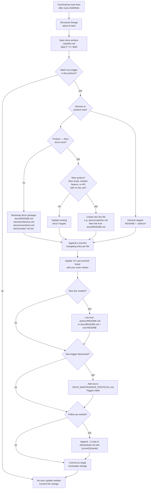

# Documentation update flow

The step-by-step procedure for keeping documentation in sync with the repository — **baseline** docs under `.ai/docs/` and **product** docs under root `docs/` when that tree exists.

## TL;DR

- **This flow is triggered automatically** — the `PostToolUse` hook in `.claude/settings.local.json` fires after every file edit and prompts you to run this flow before moving on.
- **Mandatory first step:** open [`.ai/docs/flows/docs-surface-classifier.md`](docs-surface-classifier.md) and record **Product-only** / **Harness-only** / **Both** before opening other docs.
- Triggered by **any** structural change: new folder, new file class, new feature, new protocol, new command, new dependency, removed surface.
- Updates land in the **same change** as the structural change — not in a follow-up.
- **Baseline** edits: root `README.md` + `.ai/docs/**` (and protocols/rules as needed) — **only when the change is harness-related**.
- **If `docs/` does not yet exist and the change is product-only: bootstrap the full package first** (`docs/README.md`, `docs/architecture.md`, `docs/conventions.md`, plus per-surface pages like `docs/scripts/<name>.md`). Do not assume it already exists.
- **Product** edits: root `docs/**` when you add or change product code (`scripts/`, `src/`, …) — **without** expanding `.ai/docs/architecture.md` / `conventions.md` for script-level detail.
- This file is the **single source of truth** for both harness and product doc workflows. (`docs/flows/product-documentation-flow.md` has been deprecated and points back here.)
- Every touched doc gets a **changelog line** and an updated **`## Last touched`** footer with a `{cursor}` or `{claude}` actor marker.
- If you can't fully update a doc, leave a `<!-- TODO(docs): … -->` comment **and** append a `- [ ]` task to `.ai/todo/todo.md`. Never silently skip.
- Authoritative triggers and targets: [`.ai/protocols/DOCS_MAINTENANCE_PROTOCOL.md`](../../protocols/DOCS_MAINTENANCE_PROTOCOL.md).

## Diagram — the full loop



## Step by step

### −1. How this flow gets triggered

The `PostToolUse` hook in `.claude/settings.local.json` fires after **every** `Edit` or `Write` tool call and prints a checklist asking whether the change was harness or product and whether docs + todo are done. That prompt is your cue to run this flow before moving on. You do not need to remember to do it — the hook makes it unavoidable.

### 0. Classify doc surface (mandatory)

Open [`.ai/docs/flows/docs-surface-classifier.md`](docs-surface-classifier.md) and write down **Product-only**, **Harness-only**, or **Both**, plus the exact markdown paths you will edit. If you cannot name the label, stop — do not edit docs yet.

### 1. Identify the trigger

Open [`.ai/protocols/DOCS_MAINTENANCE_PROTOCOL.md`](../../protocols/DOCS_MAINTENANCE_PROTOCOL.md) and locate the **Triggers** table.

### 2. Find the targets — and bootstrap if needed

The protocol's **Targets** table lists baseline vs product paths. Common cases:

| Change | Touch at minimum |
|--------|------------------|
| New harness / baseline folder | `README.md`, `.ai/docs/architecture.md`, `.ai/docs/conventions.md` |
| New **product** folder (`scripts/`, `src/`, `app/`, …) — **`docs/` exists** | Root **`docs/*`** (index + architecture + per-surface pages). **Do not** add product naming tables to `.ai/docs/conventions.md`. Optional: one `README.md` map row → `docs/README.md`. |
| New **product** folder — **`docs/` does not exist yet** | **Bootstrap the full package first:** create `docs/README.md`, `docs/architecture.md`, `docs/conventions.md`, and per-surface pages (e.g. `docs/scripts/<name>.md`). Then proceed as above. |
| New **product surface** (new script, module, API, feature) — **`docs/` exists, but no doc for this surface yet** | **Create** the new doc file (e.g. `docs/scripts/foo.md`, `docs/api/payments.md`). **Then** update `docs/README.md` to link it and `docs/architecture.md` if the component is new. Do not only update existing files and leave the new surface undocumented. |
| Change to an **existing** product surface — its doc already exists | Update the existing doc file(s) + `docs/README.md` if the surface description changed. No new file needed unless scope has grown into a new area. |
| New protocol | `README.md`, `.ai/docs/architecture.md`, new `.cursor/rules/*.mdc` pointer |
| New **product** feature with a flow | `docs/**` and `docs/flows/*`; **not** baseline `.ai/docs/flows/` unless the harness workflow itself changed |
| New toolchain command | `AGENTS.md`, `README.md` Quick start (if template-wide); product quick starts live under `docs/` when product-specific |

### 3. Edit every target — in the same change

Open every target doc and apply the update.

### 4. Append a changelog line + update the footer

In each touched doc:

```markdown
## Changelog
- 2026-05-12 — short description of the change {cursor}

## Last touched
{cursor} 2026-05-12
```

### 5. If you created a new doc

- **Baseline doc:** link from [`.ai/docs/README.md`](../README.md) and from root [`README.md`](../../../README.md) if user-facing.
- **Product doc:** link from root [`docs/README.md`](../../../docs/README.md) when that file exists; apply product shape from [`docs/conventions.md`](../../../docs/conventions.md) (or extend it).

### 6. If you can't fully update a doc

Use `<!-- TODO(docs): … -->` and append a task to [`.ai/todo/todo.md`](../../todo/todo.md) per the [Todo MD protocol](../../protocols/TODO_MD_AGENT_PROTOCOL.md).

### 7. Commit

One commit per structural change + its documentation updates.

## Examples

### Example A — Baseline: added `.github/workflows/ci.yml` for the template

1. Update `README.md`, `.ai/docs/architecture.md`, `.ai/docs/conventions.md`, `AGENTS.md`.
2. Changelog + Last touched on each touched file.

### Example B — Product: added `src/api/` and you maintain docs under `docs/`

1. Update **`docs/README.md`**, **`docs/architecture.md`**, add e.g. **`docs/api.md`**, and product flows under **`docs/flows/`** as needed.
2. **Do not** add `src/api/` naming guidance to `.ai/docs/conventions.md`.
3. Optional: one **`README.md`** repository-map row pointing to **`docs/README.md`**.

### Example D — New function / script added, `docs/` already exists, no doc for this surface yet

Scenario: `docs/` has `README.md`, `architecture.md`, `conventions.md`. You add `scripts/notify.py` — a brand-new script with no existing doc.

1. `docs/` exists → skip bootstrap.
2. New surface with no doc → **create** `docs/scripts/notify.md` (CLI reference, flags, examples, data sources).
3. **Update** `docs/README.md` — add a row linking `docs/scripts/notify.md`.
4. **Update** `docs/architecture.md` — add the new component if it changes the product's component map.
5. Changelog + `{claude}` on every touched file.
6. Do **not** only update `docs/README.md` and call it done — the new surface needs its own doc.

### Example E — Existing script gets a new flag, `docs/` and its doc already exist

Scenario: `scripts/weather_time.py` gains a `--units=imperial` flag. `docs/scripts/weather-time.md` already exists.

1. `docs/` exists, surface already has a doc → **update** `docs/scripts/weather-time.md` (flags table, examples).
2. No new doc file needed unless the flag represents an entirely new capability area.
3. Changelog + `{claude}` on the updated file.

### Example C — Renamed `.ai/docs/conventions.md` to `.ai/docs/style.md`

1. Update all cross-links and the index in `.ai/docs/README.md`.
2. Update root `README.md` "Where to look next" if it pointed at the old path.
3. Append changelog entries; do not delete old changelog lines inside the renamed file.

## Frequently asked

- **"Where do baseline docs live?"** — Under **`.ai/docs/`**, with root **`README.md`** as the front door.
- **"Where does product documentation live?"** — Under repo root **`docs/`** (this repo already ships a starter package: [`docs/README.md`](../../../docs/README.md)).
- **"Can I update docs in a follow-up PR?"** — No, except via the `<!-- TODO(docs): -->` + Todo MD escape hatch.

## Changelog

- 2026-05-12 — added "new surface, docs/ exists" branch to diagram + targets table + Examples D and E; create new doc file when surface is undocumented {claude}
- 2026-05-12 — added step −1 (PostToolUse hook trigger); added `docs/` bootstrap branch to diagram + targets table; clarified that missing `docs/` = create package first {claude}
- 2026-05-12 — step **0** + diagram node: mandatory [docs-surface-classifier.md](docs-surface-classifier.md) before other doc edits {cursor}
- 2026-05-12 — diagram + targets: product-only changes route to `docs/` without baseline `.ai/docs` expansion {cursor}
- 2026-05-12 — retargeted flow for `.ai/docs/` baseline vs root `docs/` product {cursor}
- 2026-05-12 — initial flow doc (was under `docs/flows/`) {cursor}

## Last touched
{claude} 2026-05-12
