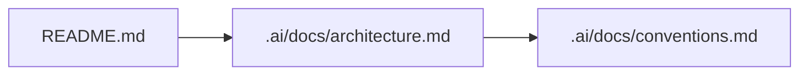

# Docs Maintenance — agent + human protocol (canonical)

**This file is the only maintained copy** of the docs maintenance rules. `AGENTS.md`, `CLAUDE.md`, `README.md`, and `.cursor/rules/docs-maintenance.mdc` all point here. Do not duplicate these rules elsewhere — they go stale.

This repository has **two documentation surfaces** (baseline vs product), one task board, and every assistant (Cursor, Claude Code, any other harness) must keep documentation in sync on every structural change.

## Mandatory gate — classify before any markdown edit

**Do not open** `.ai/docs/**/*.md`, root `docs/**/*.md`, or edit the root `README.md` for "documentation reasons" until you have:

1. Opened and followed **[`.ai/docs/flows/docs-surface-classifier.md`](../docs/flows/docs-surface-classifier.md)** — three gates, one label (**Product-only** / **Harness-only** / **Both**).
2. Written down (in chat or PR description) that label and the **exact file paths** you will touch — so mistakes are visible in review.

If your label is **Product-only**, **`.ai/docs/architecture.md`** and **`.ai/docs/conventions.md`** are **out of scope** for script/app detail (CLI tables, module names, product folder layout). Put that material under root **`docs/`**.

## TL;DR (read this if nothing else)

1. **Stop first.** Open [`.ai/docs/flows/docs-surface-classifier.md`](../docs/flows/docs-surface-classifier.md) and classify **Product-only** / **Harness-only** / **Both** before editing any doc file.
2. **Baseline docs** = **`.ai/docs/`** + root **`README.md`**. Part of the harness baseline that ships with every project from this template — blueprint, architecture, conventions, flows, glossary for the repo layout and agent agreements.
3. **Product docs** = repo root **`docs/`** (optional until you build the application). User guides, API reference, domain docs for the real product — **not** the harness blueprint.
4. **Harness mechanics** = how agents work (`.cursor/rules/`, `.claude/`, `.ai/protocols/`, `.ai/todo/`, `AGENTS.md`, `CLAUDE.md`, root config). Protocols stay in `.ai/protocols/`; do not duplicate them into `.ai/docs/` or `docs/`.
5. **Golden rule (split by surface):** *any* structural change **must** update the **correct** doc surface in the **same change**:
   - **Harness / baseline template** (paths under `.ai/` except product-only code, `.cursor/`, `.claude/`, harness-related edits to `AGENTS.md` / `CLAUDE.md`, root config that defines the template) → **`README.md`** (when the repo map or front door must reflect it) **and** relevant **`.ai/docs/*`**.
   - **Product / application** (e.g. `scripts/`, `src/`, services, UI, public API) → root **`docs/*`** (the product documentation package). **Do not** expand **`.ai/docs/architecture.md`** or **`.ai/docs/conventions.md`** with product script names, CLI details, or product-only folder rows — that belongs under **`docs/`**.
   - **Both** when a single change genuinely touches both (e.g. you add a protocol *and* a product feature in one commit — rare; split PRs when possible).
6. Mark doc edits with an **actor marker** (`{cursor}` or `{claude}`) in the file's `Last touched` footer and add a one-line entry to the file's local changelog.
7. **Diagrams are Mermaid**, embedded in the markdown they describe. No binary images unless a human explicitly asks.

## The two documentation surfaces

| Surface | Lives in | What it describes | When it updates |
|---------|----------|-------------------|-----------------|
| **Baseline docs** | `README.md`, `.ai/docs/**` | Harness layout, how pieces interconnect, where to put baseline artifacts. | **Harness-only** structural changes: `.ai/` (protocols, todo, baseline docs *about the harness*), `.cursor/`, `.claude/`, template `AGENTS.md` / `CLAUDE.md`, root config that is part of the template contract. |
| **Product docs** | `docs/**` (repo root, when present) | The application or library you build (APIs, UX, domain, standalone scripts under `scripts/`). | When you add or change **product** code, CLIs, features, or user-facing surfaces. |

`README.md` is the human front door for the whole repo. **`.ai/docs/`** travels with **`.ai/`** so the baseline documentation is one bundle with protocols and the todo board. **Root `docs/`** is the **product documentation package** — use it as soon as you have product code (including a single `scripts/*.py`).

## Product-only vs harness-only (decision table)

Use this **before** editing `.ai/docs/*`. If the answer is "product", baseline architecture/conventions must **not** gain script names, CLI tables, or product repo-map rows.

| Question | If **yes** → | Baseline `.ai/docs/*` | Root `README.md` | Product `docs/*` |
|----------|--------------|----------------------|------------------|-------------------|
| Did you only add/change **application** paths (`scripts/`, `src/`, `app/`, services, UI)? | Product-only | **No** updates to `.ai/docs/architecture.md` or `.ai/docs/conventions.md` for that code. | **Optional:** one repository-map row or a single sentence pointing readers to `docs/README.md` if the folder is new at repo root. | **Yes** — index + doc(s) for the new surface (after [`.ai/docs/flows/docs-surface-classifier.md`](../docs/flows/docs-surface-classifier.md); then [`.ai/docs/flows/documentation-update-flow.md`](../docs/flows/documentation-update-flow.md)). |
| Did you change **harness** paths (`.ai/protocols/`, `.cursor/`, `.claude/`, todo layout, template rules)? | Harness-only | **Yes** — architecture and/or conventions as appropriate. | **Yes** if the harness map or golden rules change. | **No** unless you also changed product behavior. |

**Anti-pattern (assistants must not):** stuffing product CLI reference, weather script names, or `scripts/` directory conventions into **`.ai/docs/conventions.md`** or **`.ai/docs/architecture.md`**. Those files describe the **template / harness**, not your application.

## Triggers — when assistants MUST update documentation

Classify the change with the **Product-only vs harness-only** table above, then apply only the columns that apply.

| Trigger | Harness / baseline (`.ai/docs/*` + `README.md` as needed) | Product `docs/` (when product code exists) |
|---------|-----------------------------------------------------------|---------------------------------------------|
| New **product** top-level folder (`scripts/`, `src/`, `app/`, …) | Optional: `README.md` map row or pointer to `docs/README.md` only. **Do not** treat as a baseline architecture update. | **Yes** — `docs/README.md` + `docs/architecture.md` (product) + topic doc(s) (e.g. `docs/scripts/*.md`). |
| New **harness** folder or path (under `.ai/` for protocols/todo, `.cursor/`, `.claude/`) | **Yes** — `README.md`, `.ai/docs/architecture.md`, `.ai/docs/conventions.md` as appropriate. | N/A |
| New file class in **product** code (first `.py` in `scripts/`, first `Dockerfile` for the app) | **No** convention/naming detail in `.ai/docs/conventions.md` for that product file. | **Yes** — document under `docs/` (e.g. `docs/conventions.md` for product naming, script reference pages). |
| New file class for the **baseline template** (first `.mdc`, first protocol) | **Yes** — conventions + architecture. | N/A |
| New protocol under `.ai/protocols/` | `README.md`, `.ai/docs/architecture.md`, new `.cursor/rules/*.mdc` pointer | Usually N/A. |
| New Cursor rule, Claude command, or skill | `.ai/docs/architecture.md`, `.ai/docs/conventions.md` | N/A unless it documents product behavior. |
| New product feature / module with external behavior | No baseline repo-map expansion for product modules. | `docs/*` plus `docs/flows/` if the product has its own flow. |
| Removed surface | Same baseline files — describe removal | Same under `docs/` if the product surface is removed. |
| Naming or layout convention change | `.ai/docs/conventions.md`, `README.md` only if **harness** naming changed | `docs/*` if **product** naming changed |
| New dependency, env var, or integration | `.ai/docs/architecture.md`, `.ai/docs/conventions.md`, `README.md` if **template** user-facing | Product integration docs under `docs/` when applicable |
| Toolchain command added/changed | `AGENTS.md` "Commands and verification" + `README.md` quick-start if template-wide | Product quickstart under `docs/` if product-specific |

If something is not listed but a new contributor would need to know it, **update the docs anyway** and add a row to this table in the same change.

## Targets — which doc handles which question

| Doc | Answers |
|-----|---------|
| `README.md` (root) | "What is this repo, where is everything, what's the golden rule?" — TL;DR, blueprint diagram, links. |
| `.ai/docs/README.md` | "What is in the baseline docs package and how do I navigate it?" |
| `.ai/docs/architecture.md` | "How is the baseline repo structured and how do the parts interconnect?" |
| `.ai/docs/conventions.md` | "Where do I put a new **harness** artifact, and what do I name it?" (not product `scripts/` / `src/` — those live in **`docs/`**.) |
| `.ai/docs/flows/docs-surface-classifier.md` | "Which doc tree do I edit first — baseline `.ai/docs/` or product `docs/`?" — **mandatory** before other doc edits on structural changes. |
| `.ai/docs/flows/*.md` | "What is the step-by-step flow for a baseline workflow?" |
| `.ai/docs/glossary.md` | "What does *baseline docs* / *product docs* / *protocol* mean here?" |
| `docs/README.md` (root, when present) | "What is in the product documentation package?" |
| `docs/**` (when present) | Product-specific questions (API, domain, runbooks). |
| `.ai/protocols/*.md` | Canonical agent + human contracts. **Never** duplicate these in `.ai/docs/` or `docs/` — link to them. |

## Required shape for docs

Every file in `README.md`, every file under `.ai/docs/`, and every file under repo root `docs/` (when present) **must** have these sections in this order:

1. `# Title`
2. `## TL;DR` — three to six bullets, readable in 20 seconds.
3. Body sections, in the order most useful to the reader.
4. `## Diagram` (when structural) — Mermaid block embedded inline.
5. `## Examples` — at least one concrete worked example for any non-trivial doc.
6. `## Changelog` — append-only list of meaningful edits.
7. `## Last touched` — single line: `{cursor}` or `{claude}` plus ISO date.

Style rules:

- Write for a new contributor reading on their first day.
- Prefer tables for "where does X live" lookups.
- Code references use full repo-relative paths in backticks: `` `.ai/protocols/DOCS_MAINTENANCE_PROTOCOL.md` ``.
- Mermaid for diagrams; never link to external image hosts.
- Each doc is self-contained enough that a reader can stop after the TL;DR and still be useful.

## Workflow — every structural change

```text
1. Classify the change: open [`.ai/docs/flows/docs-surface-classifier.md`](../docs/flows/docs-surface-classifier.md) and pick **Product-only** / **Harness-only** / **Both**.
2. Make the change.
3. Identify triggers from the table below (only for columns your label allows).
4. Open every target doc the triggers point at — **never** open disallowed baseline files on a **Product-only** label.
5. Update content in the same change (not "in a follow-up").
6. Append a changelog line to each touched doc.
7. Update the "Last touched" footer with your actor marker.
8. If you created a new baseline doc, link it from .ai/docs/README.md AND from README.md if user-facing.
   If you created a new product doc, link it from docs/README.md AND from README.md if user-facing.
9. If you added a new trigger, add the row to this protocol in the same change.
```

If you cannot reasonably update a doc (e.g. the structural decision is provisional), leave a **`<!-- TODO(docs): … -->`** comment in the touched doc and add a `- [ ]` task to `.ai/todo/todo.md` referencing it. Do **not** silently skip.

## Actor markers (required on every assistant edit)

Doc files in `README.md`, under `.ai/docs/`, and under repo root `docs/` (when present) must end with a single-line footer:

```markdown
## Last touched
{cursor} 2026-05-12
```

Rules (mirror the Todo MD actor marker rules):

- Use `{cursor}` if edited from Cursor. Use `{claude}` if edited from Claude Code.
- Replace the existing token with **your** token whenever you touch the file — the footer always reflects the **last assistant editor**.
- Humans may edit the footer freely or drop the token; assistants must keep one of `{cursor}` / `{claude}` present.
- The same token must also be used on the changelog line you append: `- 2026-05-12 — added Mermaid blueprint diagram {cursor}`.

## Diagrams

Mermaid is the default. Embed in the file where it belongs. Example:

````markdown

````

If a diagram is shared across multiple baseline docs, keep its source in `.ai/docs/architecture.md` and link to that section from consumers. Avoid duplicating diagram source.

Binary images (`.png`, `.svg`) are allowed only when:

- A human explicitly asks, or
- The diagram cannot be expressed in Mermaid (e.g. a real screenshot, a designer-produced asset).

Store binary assets under `.ai/docs/assets/` (baseline) or `docs/assets/` (product). Never commit production screenshots that contain real customer data.

## Hygiene

- **Never delete a changelog entry.** Assistants append only. Humans may rewrite history if they choose.
- **Never delete a doc file** without explicit human confirmation. Stale docs get a deprecation banner at the top and a changelog entry instead.
- **Never duplicate protocol rules into `.ai/docs/` or `docs/`.** Link to `.ai/protocols/*.md` instead.
- If two docs disagree, **the protocol wins**, then `README.md`, then `.ai/docs/architecture.md`. Open a `<!-- TODO(docs): … -->` to reconcile.
- Keep the TL;DR honest — if the body changed, update the TL;DR in the same edit.

## Coupling to the Todo MD protocol

The Todo MD board (`.ai/todo/`) is governed by `.ai/protocols/TODO_MD_AGENT_PROTOCOL.md`. When docs work surfaces a follow-up task, the assistant **appends** a Todo MD task following that protocol — including the `{cursor}` / `{claude}` actor marker on the task line.

The two protocols are independent but compose: a docs edit may add a todo; a todo may require a docs edit. Both edits live in the same change when triggered together.

## Future enhancements (non-binding)

- A `pre-commit` or CI check that fails when a diff touches **product paths** (`scripts/`, `src/`, …) **and** edits **`.ai/docs/architecture.md`** or **`.ai/docs/conventions.md`** without also touching root **`docs/`** (or an explicit `<!-- TODO(docs): … -->` escape hatch).
- A `pre-commit` or Cursor/Claude hook that fails if a structural change lands without touching `.ai/docs/` or `README.md` (and `docs/` when that tree exists). Track as `- [ ] Add docs-sync hook {cursor}` when the project gains a toolchain.
- A `docs/CHANGELOG.md` or `.ai/docs/CHANGELOG.md` aggregated from per-file changelogs.
- Shared Mermaid source files if diagrams are reused heavily.

## Changelog

- 2026-05-12 — **Mandatory gate:** classify via `.ai/docs/flows/docs-surface-classifier.md` before any doc edit; workflow step 0; targets table row {cursor}
- 2026-05-12 — added **product-only vs harness-only** decision table; triggers now route product code/docs to root `docs/` without updating `.ai/docs/architecture.md` / `conventions.md` {cursor}
- 2026-05-12 — split **baseline** (`.ai/docs/` + `README.md`) vs **product** (`docs/`); moved baseline package under `.ai/docs/` {cursor}
- 2026-05-12 — initial protocol authored alongside `README.md` and `docs/` scaffold {cursor}

## Last touched
{cursor} 2026-05-12
