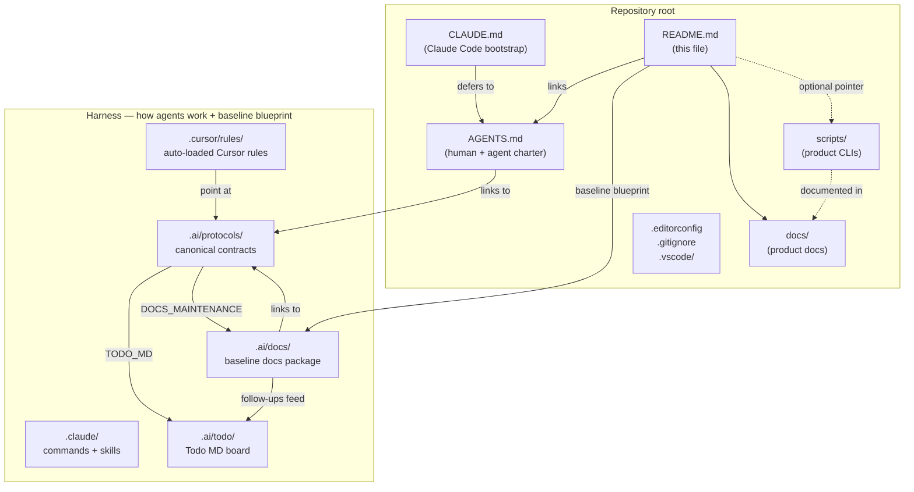
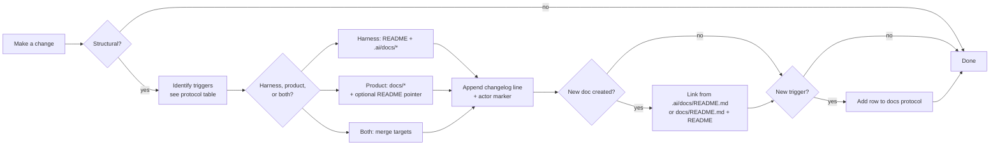

# test_project

> **Harness** (working agreements, rules, protocols, **`.ai/docs/`** baseline blueprint) plus a small **product** surface: **`scripts/`** CLIs documented under **root [`docs/`](docs/README.md)** — not in `.ai/docs/`.

## TL;DR

- **Harness + baseline docs.** The **harness** (`.ai/protocols/`, `.ai/todo/`, `.cursor/`, `.claude/`, `AGENTS.md`, `CLAUDE.md`, root config) defines how agents and humans work. Human-readable **baseline** blueprint lives under **`.ai/docs/`** (with this `README.md` as the front door).
- **Product docs.** Anything you ship as **application/library behavior** (`scripts/`, `src/`, …) is documented in **root [`docs/`](docs/README.md)** — full package: architecture, conventions, per-script pages. Rules: [`.ai/protocols/DOCS_MAINTENANCE_PROTOCOL.md`](.ai/protocols/DOCS_MAINTENANCE_PROTOCOL.md) (*Product-only vs harness-only*).
- **One task board.** Active work lives in `.ai/todo/todo.md`; backlog in `someday.md`; archive in `todo.archive.md`. Rules in `.ai/protocols/TODO_MD_AGENT_PROTOCOL.md`.
- **Golden rule.** Classify the change: **harness** edits update **`README.md`** + **`.ai/docs/*`**; **product-only** edits update **`docs/*`** (and optionally **one** `README.md` map pointer). **Do not** put product CLI tables into `.ai/docs/*`. Changelog + actor marker on every touched file.
- **Diagrams are Mermaid.** Embedded inline so GitHub and most editors render them.
- **Assistants never delete todo lines or doc changelog entries.** Append or amend only. Removal is human-only.

## Blueprint — how the repo is wired

## Repository map

| Path | Purpose | Maintained by |
|------|---------|---------------|
| `README.md` | This file. Entry point, TL;DR, blueprint diagram, golden rules. | Humans + assistants (per docs protocol) |
| `AGENTS.md` | Human + agent charter for working agreements. | Humans + assistants |
| `CLAUDE.md` | Claude Code bootstrap. Defers to `AGENTS.md`. | Humans + assistants |
| `.editorconfig` | Whitespace + charset baseline. | Humans |
| `.gitignore` | Standard ignores (secrets, build, deps). | Humans |
| `.vscode/settings.json` | Workspace settings (currently Todo MD paths). | Humans |
| `.cursor/rules/` | Cursor `.mdc` rules, auto-loaded. `foundations.mdc` is the baseline; pointer rules defer to `.ai/protocols/`. | Humans + assistants |
| `.claude/commands/`, `.claude/skills/` | Claude Code surface only. Slash commands + skills. | Humans + assistants |
| `.ai/protocols/` | Canonical agent + human contracts. **Single source of truth** for working agreements. | Humans + assistants |
| `.ai/todo/` | Todo MD task board (`todo.md`, `someday.md`, `todo.archive.md`). | Humans + assistants (append/amend; never delete) |
| `.ai/docs/` | **Baseline** docs package — architecture, conventions, flows, glossary for the harness and repo layout. Ships with every project from this template. | Humans + assistants (per docs protocol) |
| `docs/` | **Product** documentation package — [`README.md`](docs/README.md), [`architecture.md`](docs/architecture.md), [`conventions.md`](docs/conventions.md), [`scripts/`](docs/scripts/). | Humans + assistants (per docs protocol) |
| `scripts/` | **Product** CLIs (not harness). Details: [`docs/scripts/weather-time.md`](docs/scripts/weather-time.md). | Humans + assistants |

## Golden rules

These rules apply to **Cursor, Claude Code, and any other assistant**. Humans can override at their own risk; assistants must not.

| # | Rule | Source of truth |
|---|------|-----------------|
| 1 | **Structural change → docs in the same change, on the correct surface.** **Harness:** `README.md` + `.ai/docs/*`. **Product-only:** `docs/*` (do not expand `.ai/docs/architecture.md` / `conventions.md` with product script details). **Both** when a change truly touches both. Changelog line + `{cursor}` / `{claude}` on each touched file. | `.ai/protocols/DOCS_MAINTENANCE_PROTOCOL.md` |
| 2 | **Never duplicate protocol content into `.ai/docs/` or `docs/`.** Link to `.ai/protocols/`; protocols never get mirrored. | `.ai/protocols/DOCS_MAINTENANCE_PROTOCOL.md` |
| 3 | **Assistants never delete todo lines.** Append or in-place edit only. `{cursor}` / `{claude}` marker required when an assistant touches a line. | `.ai/protocols/TODO_MD_AGENT_PROTOCOL.md` |
| 4 | **Assistants never delete doc changelog entries.** Append only. | `.ai/protocols/DOCS_MAINTENANCE_PROTOCOL.md` |
| 5 | **Diagrams are Mermaid, embedded inline.** Binary images only on explicit human request. | `.ai/protocols/DOCS_MAINTENANCE_PROTOCOL.md` |
| 6 | **Small, reviewable changes. No drive-by refactors.** | `.cursor/rules/foundations.mdc` |
| 7 | **No secrets in the repo.** Env vars + `.gitignore`d local files only. | `.cursor/rules/foundations.mdc` |
| 8 | **Claude Code: read `AGENTS.md` + all 4 protocol/flow files before acting — every session, no exceptions.** Enforced by hard block in `CLAUDE.md` and `SessionStart` hook in `.claude/settings.local.json`. | `CLAUDE.md`, `AGENTS.md` |
| 9 | **Docs + todo updates happen in the same change as the work — never as a follow-up.** Enforced by `PostToolUse` hook in `.claude/settings.local.json` that fires after every edit. | `.ai/protocols/DOCS_MAINTENANCE_PROTOCOL.md` |

## The docs-update flow

Full flow: [`.ai/docs/flows/documentation-update-flow.md`](.ai/docs/flows/documentation-update-flow.md) (single source of truth — covers both harness and product surfaces).

## Worked example — "I added product code under `src/api/`"

1. **Classify:** this is **product-only** (not a harness path).
2. **Product targets:** update **`docs/README.md`**, **`docs/architecture.md`**, add e.g. **`docs/api.md`**, and **`docs/flows/*`** if you document a customer-facing flow.
3. **Baseline:** **no** new rows in `.ai/docs/conventions.md` for `src/api/` file naming. **Optional:** one **`README.md`** repository-map row pointing readers to **`docs/README.md`**.
4. **Changelog + Last touched** on every file you touched.

## Quick start

This repo currently ships one tiny project — a weather + local-time quirky-sentence CLI. Read about it in its own docs:

- **Project docs:** [`docs/README.md`](docs/README.md) (architecture, conventions, CLI reference).
- **Run it:** `python3 scripts/weather_time.py` (Python 3.9+, stdlib only). Offline: add `--demo`.

When the real product toolchain lands:

- Install / lint / test / build commands go in `AGENTS.md` **Commands and verification** section.
- Add a **product** quick start under **`docs/`** (and link from [`docs/README.md`](docs/README.md)).
- Harness-wide toolchain rows in this README + `.ai/docs/*` **only** if the template itself gains a shared dev command.

## Where to look next

| Question | File |
|----------|------|
| How do agents and humans collaborate here? | [`AGENTS.md`](AGENTS.md) |
| What does Claude Code load on session start? | [`CLAUDE.md`](CLAUDE.md) |
| Which doc tree do I edit first (baseline vs product)? | [`.ai/docs/flows/docs-surface-classifier.md`](.ai/docs/flows/docs-surface-classifier.md) |
| What are the docs maintenance rules? | [`.ai/protocols/DOCS_MAINTENANCE_PROTOCOL.md`](.ai/protocols/DOCS_MAINTENANCE_PROTOCOL.md) |
| What are the Todo MD rules? | [`.ai/protocols/TODO_MD_AGENT_PROTOCOL.md`](.ai/protocols/TODO_MD_AGENT_PROTOCOL.md) |
| Baseline package index | [`.ai/docs/README.md`](.ai/docs/README.md) |
| How is the baseline repo structured? | [`.ai/docs/architecture.md`](.ai/docs/architecture.md) |
| Where do I put a new harness artifact? | [`.ai/docs/conventions.md`](.ai/docs/conventions.md) |
| Glossary (baseline vs product docs) | [`.ai/docs/glossary.md`](.ai/docs/glossary.md) |
| Product docs index | [`docs/README.md`](docs/README.md) |
| Weather + time CLI (`scripts/weather_time.py`) | [`docs/scripts/weather-time.md`](docs/scripts/weather-time.md) |
| What's on the task board? | [`.ai/todo/todo.md`](.ai/todo/todo.md) |

## Changelog

- 2026-05-12 — added golden rule #9: docs + todo in same change, enforced by PostToolUse hook {claude}
- 2026-05-12 — added golden rule #8: mandatory session-start reads enforced via CLAUDE.md + SessionStart hook {claude}
- 2026-05-12 — linked mandatory doc-surface classifier in "Where to look next" {cursor}
- 2026-05-12 — product doc package under `docs/` for `weather_time.py`; README quick start points at product docs; golden rule + diagram split **harness vs product** per protocol {cursor}
- 2026-05-12 — added `scripts/` row + Quick start for `scripts/weather_time.py` (first `.py` artifact) {cursor}
- 2026-05-12 — moved baseline docs package from `docs/` to `.ai/docs/`; reserved root `docs/` for product; updated diagrams and links {cursor}
- 2026-05-12 — initial blueprint README alongside docs scaffold and docs maintenance protocol {cursor}

## Last touched
{claude} 2026-05-12
