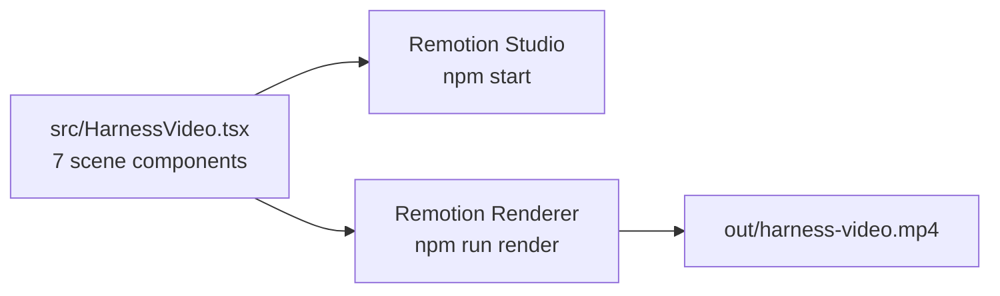

# Product architecture

## TL;DR

- Primary product: `harness-video/` — Remotion 7-scene harness explainer, 93s, 1280×720.
- Supporting script: `scripts/weather_time.py` — stdlib Python CLI, no install needed.
- Full reference: [`docs/harness-video/README.md`](harness-video/README.md).

## Components

| Path | What it is | Runtime |
|------|-----------|---------|
| `harness-video/` | Remotion video — 7-scene harness explainer, 93s @ 30fps | Node 18+, React 18, Remotion 4 |
| `scripts/weather_time.py` | CLI — weather + time → one quirky sentence | Python 3.9+, stdlib only |

## harness-video data flow

| Scene | Title | Duration |
|-------|-------|----------|
| 01 | Cursor + Claude Code — Session Start | 15s |
| 02 | Task Received | 10s |
| 03 | Claude Code Writes the Script | 15s |
| 04 | Docs Surface Classifier | 12s |
| 05 | Docs Package Updated | 15s |
| 06 | Task Board Updated | 10s |
| 07 | Two Actors, One Harness | 20s |

## Changelog

- 2026-05-12 — re-bootstrapped; harness-video as primary; Cursor + Claude Code dual-actor model {claude}

## Last touched
{claude} 2026-05-12
